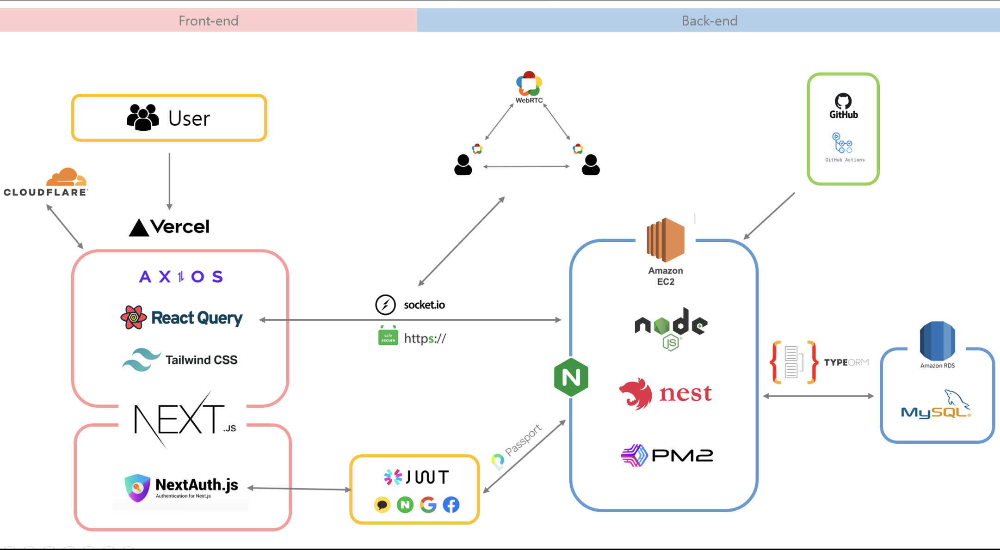

# WHO ARE YOU

### E반 1조

> 범인은 이 안에 있어!!

WHORU 프로젝트는 <크라임씬> 프로그램을 벤치마킹 해서 만든 온라인 롤플레잉 추리게임입니다.
한 저택에서 "장세민"은 살해당했고, 범인은 과연 누구일까?!

[WHORU 바로가기!](https://whoru.name)

---

## ✅ 작업 기간 및 팀원 소개 ✅

### 🕰 2022-06-24 ~ 2022-8-05

### 

- 노희준(부리더)

### 

- 진정우(리더)
- 정지은

---

## Service Architecture



### 🎬 주요 핵심 기능

- 로그인
- 회원가입
- 소켓
  - 실시간 채팅
  - 실시간 힌트 공유
  - 실시간 방 만들기
  - 실시간 대기방 유저 목록

## Tech Stack

         

## 개발 도구 및 협업 도구

     

## 개발 환경

  

## Commit Convention

```
feat: 새로운 기능 추가
fix: 이미 있는 코드를 수정했을 때나 버그를 수정했을 때
refactor: 코드 리팩토링(하나의 페이지 혹은 하나의 기능을 싹 갈아엎었을때)
test: 테스트 코드
chore: 패키지 매니저 수정이나 세미콜론 추가, 주석 제거(개발에 영향이 가지 않는 코드를 수정을 했을 때)
```

## Trouble Shooting


<details>
<summary>도입 이유</summary>
<div markdown="1">

무중단 배포를 위한 로드 밸런서
HTTPS, SSL

</div>
</details>

<details>
<summary>에러 및 어려웠던 이유</summary>
<div markdown="1">

Nginx를 처음 공부하는 거였기 때문에 개념이 잘 잡혀져 있지 않았다.
개념이 잘 잡혀져 있지 않은 상태에서 구축을 하려고 하니까 어디서 왜 에러가 생기는지도 잘 몰랐기 때문에 어떤 식으로 해결해야 하는지 감이 오지 않았다

</div>
</details>

<details>
<summary>해결 방법</summary>
<div markdown="1">

구글링을 통해서 Nginx 관련 default 파일을 수정
수정으로도 해결이 되지 않아서 처음부터 다시 구축(을 하면서 동시에 구조가 어떻게 되는지 파악)
구조를 어떻게 만들어지는지 파악하면서 구축을 하기 때문에 같은 에러가 났을 때 왜 에러가 나는지 원인 파악이 가능했다

</div>
</details>
